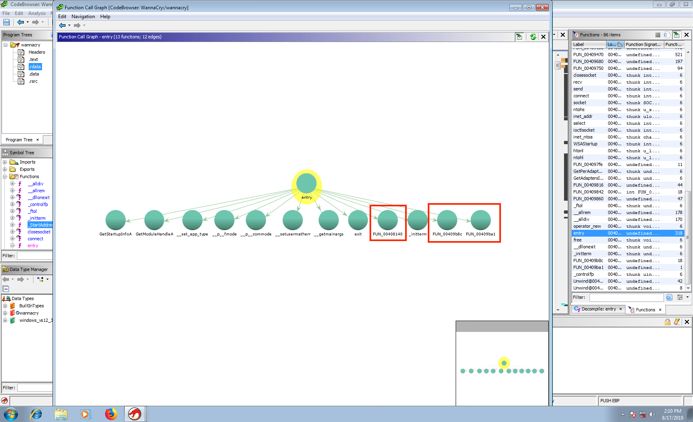

# Finding the WannaCry Kill-Switch

WannaCry is particular ransomware strain that is notable in that researchers were able to quickly identify a 'kill-switch' embedded in it. Triggering the kill-switch stopped the spread of the malware before it was able to spread completely across the internet. The purpose of this analysis to to retrace the steps of the researchers and also find the kill-switch. 

## Software
* VMWare Workstation 15.0.0 Pro
* Windows 7
* OpenJDK 12.0.2 (https://jdk.java.net/12/)
* Ghidra 9.0.4 (https://ghidra-sre.org/)
* WannaCry Malware Sample (from https://ghidra.ninja/); Retrieved Aug 17, 2019; MD5 Hash - db349b97c37d22f5ea1d1841e3c89eb4

## Setup
1. A clean Windows 7 virtual machine was created from a standard installation ISO. Virtual machine tools were not installed to isolate the host as much as possible.
1. The latest version of Mozilla Firefox (68.0.2) was installed solely to download OpenJDK, Ghidra, and the WannaCry sample.
1.  After the required files were downloaded, the virtual machine was shut down, the network interface was removed from the virtual machine, and the VM was restarted. This ensures that the malware cannot escape the system.
1. Ghidra and the OpenJDK were extracted, and Ghidra was configured to use the JDK.
1. The malware sample was extracted; the decryption password was 'ghidra.ninja'.
1. A new project was created in Ghidra, and the sample was imported into the project. The file was processed with all non-prototype analyzers.

## Analysis

The standard entry point for a C executable is the `main` function. This function doesn't exist in this executable, but there is an `entry` function, which appears to have the same purpose. Utilizing the 'Function Call Graph' view of Ghidra, we can easily view the functions that are called from the `entry` function:

Immediately apparent is that there are three non-standard functions that are called from the `entry` function. It is possible that the kill switch is hidden behind one of the other functions, but we should first search those that are not part of the standard Windows API: `FUN_00408140`, `FUN_00409b8c`,  `FUN_00409ba1`. (Functions are named by their starting address)

Two of the functions (`FUN_00409b8c`, `FUN_00409ba1`) do not appear to really do anything. The decompiled code for `FUN_00409ba1` just returns to the calling function, and `FUN_00409b8c` makes a single call to `_controlfp`, which is a function to enable floating point calculations.

The third function's call graph has more interesting functions that are called, including `InternetOpenA`, `InternetOpenUrlA`, `InternetCloseHandle`, and `FUN_00408090`, another custom function.

To help keep track of this function, it is renamed to `something_interesting`. The function definitions related to the Internet functions are updated with argument types (according to Microsoft documentation), which helps to understand what is occurring in this function. Other variables are renamed to provide additional clarity, and comments are added.

The logic of this function becomes much clearer, and the kill-switch is apparent. The function attempts to connect to `iuqerfsodp9ifjaposdfjhgosurijfaewrwergwea[.]com` (stored in the variable now called `weird_url`). If the connection is successful (returns 0), the function cleans up its connection, and ends the process. On the other hand, if the connection fails, it calls another function (now labeled `bad_things`)

This `bad_things` function checks the number of arguments that were made to the executable, and if there are less than two of them, it enters the function now called `argc_small`.

The `argc_small` function makes calls to additional functions that create a Windows Service called `mssecsvc2.0` or `Microsoft Security Center (2.0)`, and copy the executable to the windows directory.
 

There is some additional logic in the copy_exec function that does not appear to have decompiled correctly. There are a large number of variables (primarily pointers, sometimes 3 or 4 layers deep), that appear to just shuffle around values.

After the new service and executable are installed, the functions return back to the `bad_things` function, which checks that the service is installed, and attempts to start it. The logic the checks into the service manager, and completes the process of becoming a running service. The service initializes the Crypto API, as well as the Winsock API for network connections. 

# Observations
* The kill switch was not difficult to find, and was not at all obfuscated. This could indicate that this version of the WannaCry malware was still underdevelopment, and was not intended to be released in the wild.
* Ghidra is highly effective at decompiling executables, but does have some limitations.
* It is unclear what the purpose of checking the number of command line arguments is. Most likely it is a way to determine if the process is running as a service or not, but there was no indication of adding additional arguments to the service when the service was being created.
* The layers of threading add some complexity to understanding the flow of functions, especially since launching a new thread does not use a function jump, but instead just a label.
* It was not necessary to actually run the malware in order to find the kill switch, or evaluate the logic.

# Additional Screenshots

